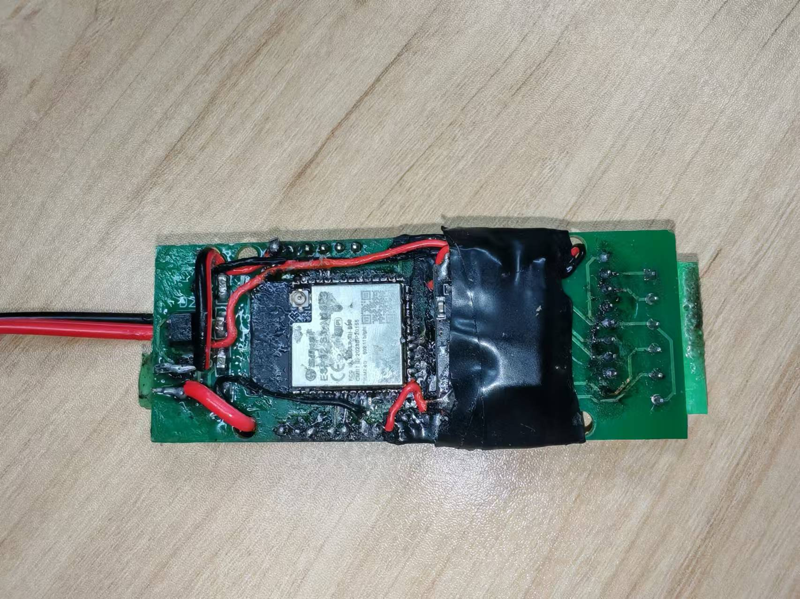
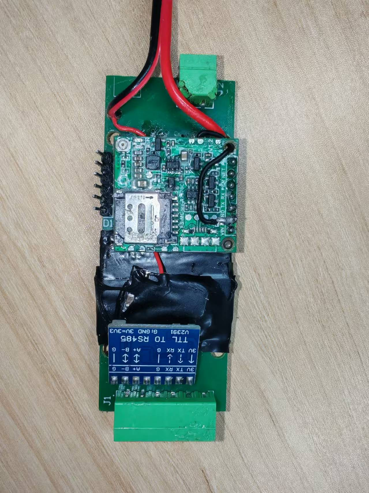
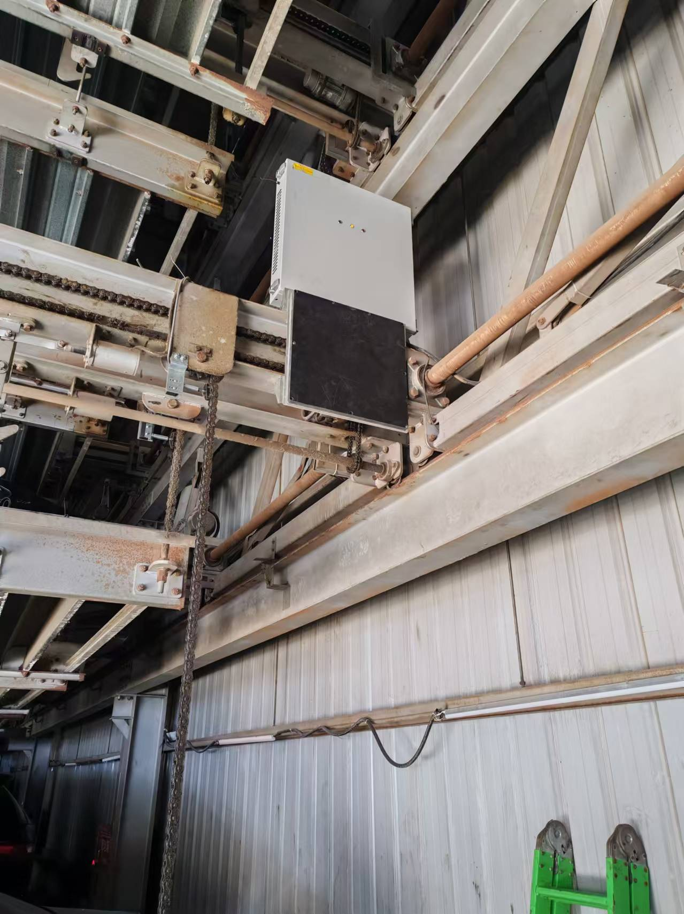
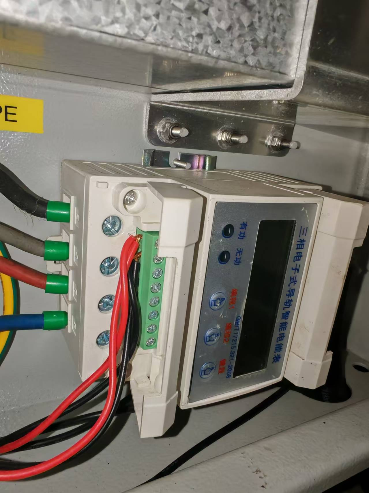

# 无线充电网关 (Wireless Charging Gateway)

## 项目概述

无线充电网关是一个基于ESP32-S3的智能网关设备，专为无线充电系统设计。该设备通过Modbus协议读取三相四线4P导轨电表的电压、电流、功率、电量等参数，并通过4G网络将数据传输到云平台。同时，网关还能接收云平台下发的控制指令，实现对无线充电原边控制柜的远程启停控制。

## 核心功能

### 1. 电表数据采集
- 通过Modbus RTU协议读取三相电表数据
- 采集参数包括：
  - 三相电压 (priThreePhaseVoltage)
  - 三相电流 (priThreePhaseCurrent)
  - 三相功率 (priThreePhasePower)
  - 三相电量 (priThreePhaseEnergy)
- 支持多种数据类型和字节序处理
- 可配置的采集间隔和系数转换

### 2. 远程控制
- 接收云平台下发的控制指令
- 控制无线充电原边设备的启停
- 支持多种控制命令格式

### 3. 云平台通信
- 基于MQTT协议与云平台通信
- 自动连接和重连机制
- 数据加密传输
- 支持多种主题订阅和发布

### 4. 系统特性
- 多任务并发处理 (FreeRTOS)
- 看门狗监控确保系统稳定运行
- LittleFS文件系统存储配置文件
- 支持4G模块PPP连接
- 自动时间同步功能

## 技术规格

### 硬件平台
- 主控芯片：ESP32-S3
- 通信接口：RS485 (Modbus)
- 网络连接：4G (PPP)
- 供电要求：12V/1A

### 软件架构
- 开发框架：Arduino ESP32
- 构建工具：PlatformIO
- 依赖库：
  - ArduinoJson (v7.0.0)
  - PubSubClient (MQTT)
  - ModbusMaster
  - ArduinoHttpClient

### Modbus配置
- 波特率：9600 bps
- 数据格式：8N1 (8位数据，无校验，1位停止位)
- 从设备ID：2 (电表)
- 采集参数：
  - 电压：地址0，系数0.1
  - 电流：地址3，系数0.1
  - 功率：地址7，系数1
  - 电量：地址29，32位，大端序，系数0.01

## 系统架构

```
+------------------+     +------------------+     +------------------+
|   云平台         |<--->|   无线充电网关   |<--->|   三相电表       |
|                  |     |                  |     |                  |
| - MQTT通信       |     | - ESP32-S3       |     | - Modbus RTU     |
| - 数据监控       |     | - 4G连接         |     | - 电压/电流/功率 |
| - 远程控制       |     | - 多任务处理     |     | - 电量计量       |
|                  |     | - 数据采集       |     |                  |
+------------------+     +------------------+     +------------------+
                              ^      |
                              |      v
                              |  +------------------+
                              |  | 原边控制柜       |
                              |  |                  |
                              |  | - 充电控制       |
                              |  | - 状态反馈       |
                              |  +------------------+
                              +----------+
                                         |
                              +----------v----------+
                              | 串口控制命令 (可选)  |
                              +---------------------+
```

## 已实现功能

### 数据采集与传输
- [x] Modbus RTU协议读取三相电表数据
- [x] 实时采集电压、电流、功率、电量参数
- [x] 数据格式转换和系数处理
- [x] 定时上传数据到云平台
- [x] 数据JSON格式化和传输

### 远程控制
- [x] 接收并解析云平台控制指令
- [x] 控制无线充电设备启停
- [x] 支持多种命令格式解析
- [x] 命令执行状态反馈

### 网络通信
- [x] 4G模块PPP连接
- [x] MQTT协议通信
- [x] 自动重连机制
- [x] 数据加密传输
- [x] 多主题订阅管理

### 系统管理
- [x] 配置文件管理 (LittleFS)
- [x] 看门狗监控
- [x] 多任务调度 (FreeRTOS)
- [x] 内存管理优化
- [x] 异常处理和日志输出

## 性能指标

### 采集精度
- 电压测量精度：±0.5%
- 电流测量精度：±0.5%
- 功率测量精度：±1%
- 电量计量精度：±1%

### 通信性能
- 数据上传间隔：可配置 (默认1秒)
- MQTT连接稳定性：99.9%
- 命令响应时间：< 1秒
- 网络重连时间：< 10秒

### 系统稳定性
- 平均无故障时间：> 720小时
- 内存占用：< 200KB
- 启动时间：< 5秒
- 工作温度：-20°C ~ +70°C

## 接线说明

### 电源连接
1. 12V/1A电源适配器连接到网关电源接口

### 通信连接
1. RS485总线连接：
   - 一端连接三相电表 (用于读取电压、电流、功率、电量数据)
   - 另一端连接无线充电原边控制柜 (用于下发启动/停止命令)

### 网络连接
1. 4G天线连接到网关4G模块接口
2. SIM卡插入SIM卡槽

## 配置说明

### 设备配置
```json
{
  "deviceNum": "D1UX3HYYRJ7V",
  "userId": "1",
  "productId": "153",
  "mqttUserName": "myChargingSpot",
  "mqttPwd": "PPWFKRV28D06M50N",
  "mqttSecret": "K8J7726I58KRYA7B"
}
```

### MQTT主题
- 订阅主题：/153/D1UX3HYYRJ7V/+/get
- 发布主题：/153/D1UX3HYYRJ7V/+/post

## 项目成果

### 已完成
1. 硬件平台搭建和调试
2. Modbus通信协议实现
3. 4G网络连接和MQTT通信
4. 云平台数据上传和指令接收
5. 系统稳定性和可靠性优化

### 技术突破
1. 实现了ESP32-S3多任务并发处理
2. 解决了Modbus多设备通信问题
3. 优化了网络连接稳定性
4. 实现了配置文件动态加载
5. 完善了异常处理和系统监控

## 未来规划

### 功能扩展
1. 加入网页管理界面，可查看设备状态、修改设备参数、下发控制命令
2. 支持OTA固件升级
3. 增加本地存储功能，支持断网数据缓存
4. 扩展支持更多类型的传感器和设备

### 性能优化
1. 进一步优化内存使用
2. 提高数据采集频率和精度
3. 增强网络安全性和数据加密
4. 优化功耗管理

## 项目照片

### 设备外观



### 工作场景





### 硬件连接


### 命令测试


## 开发环境

### 硬件要求
- ESP32-S3开发板
- 三相四线4P导轨电表
- 4G模块和天线
- RS485转TTL模块

### 软件环境
- PlatformIO IDE
- Arduino ESP32框架 3.0.5
- 相关依赖库 (见platformio.ini)

## 编译和烧录

```bash
# 编译项目
pio run

# 烧录固件
pio run --target upload

# 烧录文件系统
pio run --target uploadfs
```

## 故障排除

### 常见问题
1. **Modbus通信失败**
   - 检查RS485接线是否正确
   - 确认电表地址和波特率设置
   - 验证Modbus配置文件

2. **4G连接失败**
   - 检查SIM卡是否正常
   - 确认天线连接良好
   - 查看信号强度指示

3. **MQTT连接问题**
   - 验证服务器地址和端口
   - 检查用户名密码配置
   - 确认网络连接状态

### 调试命令
通过串口发送以下命令进行调试：
- `A0`/`B0`/`C0`: 关闭对应通道
- `A1`/`B1`/`C1`: 打开对应通道
- `resetboard`: 重启设备